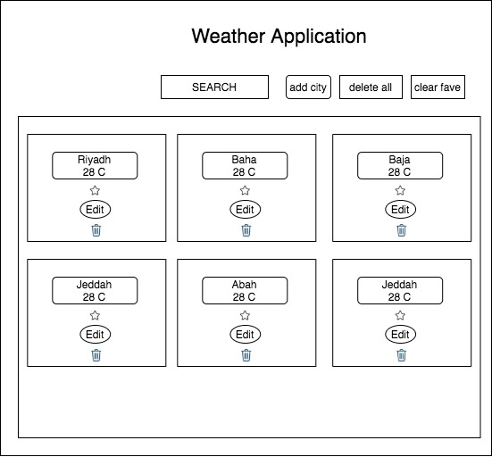

# Weather Application

Weather app where you enter any city in search box to get weather information. 

## Wireframe

## User storie

* User want to be able to add weather item in list 

* User want to be able to mark Favorite item in list and show it on top of other weather list

* User want to be able to delete weather item from list 

* User want to be able to edit weather item in list

* User want to be able to delete all weather list items

* User want to be able to clear unfavorite weather items

## Technologies Used

* Reactjs 
* React Modal
* Axios Api
* CSS
* developer tool

## Future Work

* Add User Sign Up, Sign In, and Sign Out firebase and react authentication.
* Save the data to localStorage or an API

## Helpful Resouces

* React Documentation
* Array.prototype.map() MDN Docs.
* Axios Docs.

